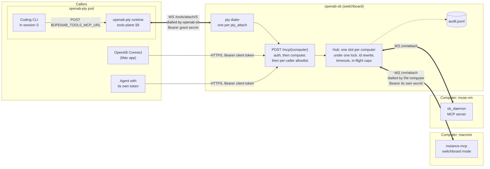

# openab-sb — OpenAB Switchboard

Lets OpenAB Connect and agents in OpenAB PTY sessions call tools on machines that
**can only dial out** — a Meta Muse Secure VM, a box behind NAT, anything with no inbound
port and no `tailscale serve`.

Each machine dials the switchboard over one WebSocket and serves MCP on it. The switchboard
relays calls down that socket and sends the results back. It does not run tools and it
does not store anything.

One switchboard serves **many computers**: one port, one `tailscale serve` entry, one
approved address, and one endpoint per computer. Callers are granted access per computer,
deny by default.



Thick links are WebSockets, and each label says which side dials. Calls always flow from
the callers toward a computer: a computer dials in and then serves MCP on its own socket,
and the switchboard dials the pod and then answers the pod's requests on that socket. TLS
comes from whatever fronts the switchboard (`tailscale serve` or `cloudflared`; see Run).

## How it fits

- **Southbound (computer → switchboard):** the computer dials `GET /vm/attach` with a bearer
  secret, and **the secret alone selects which computer it is**. The URL does not change, so
  any v1 daemon works as is. The frames are plain MCP JSON-RPC, with no custom envelope, so
  any MCP server becomes a switchboard backend by dialling out instead of listening. The
  contract is in [`docs/SOUTHBOUND-CONTRACT.md`](docs/SOUTHBOUND-CONTRACT.md), and a reference
  daemon is in [`examples/muse-daemon/`](examples/muse-daemon/sb_daemon.py).
- **Northbound for Connect:** add a computer in Connect with URL
  `https://<switchboard>/mcp/<computer>` and a client token — one entry per computer, which is
  how MCP clients already hold several servers. `https://<switchboard>/mcp` is the caller's
  `default_computer` and never changes meaning when a computer is added. Connect calls
  `sys_info` and `screenshot`. While a computer is offline, Connect still finds the switchboard
  (`/healthz` is 200) and shows the tool error "the VM is not connected" rather than
  "unreachable". `GET /readyz/<computer>` is the per-computer probe for monitoring.
- **Northbound for PTY:** this needs no change to openab-pty. The switchboard plays the
  "Mac" in openab-pty's tools plane (`CLIENT-CONTRACT.md` §9). It dials the pod's
  `/tools/attach/{session}` and serves the tools of the one computer named in that
  `[[pty_attach]]`, so the CLI in that session reaches them through its usual
  `$OPENAB_TOOLS_MCP_URL`. An agent that can reach the switchboard directly can also use
  `POST /mcp/<computer>` with its own token.
- **Pickers** (instance-mcp's hands-node registry, Connect) read `GET /computers`. There is no
  `list_computers` MCP tool: a model already on `/mcp/<computer>` could not act on such a list.

## Config

```toml
max_inflight = 8               # default for every computer

[[computer]]
name = "macmini"               # 1-64 chars of [A-Za-z0-9_-]; no `.`
secret_sha256 = "sha256:…"     # the identity. The name is just a label

[[computer]]
name = "muse-vm"
secret_sha256 = "sha256:…"
max_inflight = 4               # optional override

[[client]]
name = "muse"
token_sha256 = "sha256:…"
computers = { macmini = ["sys_info", "screenshot"] }   # deny by default
max_inflight = 4               # this caller's share of one computer

[[client]]
name = "pahud"
token_sha256 = "sha256:…"
default_computer = "macmini"                           # what bare /mcp means
computers = { "*" = ["*"] }    # owner: every computer, including ones added later

[[pty_attach]]
name = "kiro-1040"
computer = "muse-vm"           # required when more than one is configured
url = "wss://…/tools/attach/laptop"
secret_file = "…"
tools = ["*"]
```

| Rule | |
|---|---|
| identity | the verifier. Whoever holds a computer's secret answers as that computer, so a leaked secret is replaced, not tolerated. Anything a computer reports about itself (`serverInfo`, hostname, forwarded headers) is shown, never trusted |
| names | computers are `[A-Za-z0-9_-]`, 1-64 chars. `.` is refused, because a bare TOML key such as `rpi1.local` is a dotted key. Client and pty-attach names keep `.`, and they are a separate namespace from computer names (audit lines carry `principal` and `computer` separately) |
| verifiers | unique across every computer and every client |
| access | `computers` may not be empty; a computer missing from it does not exist for that caller, on every route. `"*"` may not be mixed with names |
| `default_computer` | required for a `"*"` caller and for anyone who names more than one computer; optional (and implied) when exactly one is reachable. It must be a computer that caller may reach |
| every name must exist | in `default_computer`, in a `computers` table or in `[[pty_attach]].computer`. Otherwise a typo such as `macmni` would grant nothing today and pre-grant access to whatever takes that name later. So removing a computer fails the reload until every block naming it is edited in the same change |
| caps | `max_inflight` is 1..=64 everywhere it appears |
| v1 | `[vm]` still loads as a computer named `default`; a client's `tools = [...]` becomes `computers = { default = [...] }`; a `[[pty_attach]]` without `computer` targets it. `[vm]` together with `[[computer]]`, or `tools` together with `[[computer]]`, is an error |

`openab-sb check` applies all of this and warns about any computer no client or pty attach
may use.

## Behaviour

| | |
|---|---|
| computers | one live socket each, selected by the presented secret. A newer attach with the *same* secret replaces the older one (`4002`), and the older socket's cleanup never touches the newer one or another computer. A computer that fails the MCP handshake is closed with `4005` |
| isolation | one lock over the whole table, but a pending table, `max_inflight`, ping liveness, close handling and `generation` per computer. A slow or dead computer cannot starve another |
| ids | rewritten per call, so callers sharing one socket cannot collide |
| methods | `initialize` and `ping` are answered locally (`initialize` names the computer in its instructions), `tools/list` is filtered, `tools/call` is policed. Everything else gets `-32601` and is not forwarded |
| policy | resolved once per request, from the path, before any frame is sent: the token, then the computer, then the tool. `vm_status` is always available and carries a `computer` field |
| limits | per computer `max_inflight` (default 8), plus a per-caller share of it — `[[client]].max_inflight` / `[[pty_attach]].max_inflight`, default half the live socket's limit rounded up — so one caller cannot occupy a shared computer. Per-tool timeouts (`screenshot` 10 s, default 60 s); 16 MiB frames from a computer |
| failures | `-32001` computer offline (returned as a tool error so clients keep the server), `-32002` over a cap, `-32003` timed out, `-32004` disconnected mid-call. Nothing is retried |
| state | memory only. A restart fails every in-flight call |
| audit | JSON lines, file mode `0600`: attach, detach, takeover, rename, auth failures (capped at 20 a minute, the rest summarised), and every `tools/call` with caller, computer, tool, outcome, latency, size, and (optionally) arguments. Results are never logged |
| PTY attach | redials with backoff on drops, on `4006` (pod replaced) and on proxy errors such as `502`; a `401`/`403`/`429` refusal waits a minute for a fresh grant; stops on every other `4xxx`, per openab-pty §9.2. At most 64 requests from one pod are handled at once, and the attach's own `max_inflight` applies on top |

### Reload (`SIGHUP`)

| Change | Effect |
|---|---|
| Client added, removed, token rotated, allowlist or `default_computer` changed | from the next request |
| Computer added | its slot exists at once and accepts an attach |
| Computer removed, or its verifier rotated | that socket closes with `4003`. Its in-flight calls fail with `-32004` and **may have run**. Other computers are untouched |
| Same verifier, new name (including a verifier moved between two names) | the live socket is relabelled, an audit line `computer_renamed` records it, and nothing closes |
| `max_inflight`, global or per computer | reloaded, and applied to that computer's next attach. A live socket keeps the value it attached with |
| Per-caller `max_inflight` | from that caller's next call |
| A `[[pty_attach]]`'s `computer`, `tools` or `max_inflight` | swapped on the running attach, from its next request, so a renamed computer keeps serving that pod |
| `[[pty_attach]]` added or removed, or its `url` or `secret_file`, `listen`, timeouts | need a restart; each is logged at `warn` on reload |

The computer table is swapped before client auth, so a daemon presenting a newly added
secret is never refused with `4003` — which would tell it to stop.

## Run

Releases ship a static Linux binary (amd64, arm64) and a macOS arm64 binary:

```bash
V=0.2.0; A=linux-amd64   # or linux-arm64, darwin-arm64
curl -fsSLO https://github.com/openabdev/openab-sb/releases/download/v$V/openab-sb-$V-$A.tar.gz
curl -fsSLO https://github.com/openabdev/openab-sb/releases/download/v$V/SHA256SUMS
grep "$A" SHA256SUMS | shasum -a 256 -c -
tar xzf openab-sb-$V-$A.tar.gz
```

Or build from source:

```bash
cargo build --release
./target/release/openab-sb gen-secret            # once per computer, once per client
cp openab-sb.toml.example openab-sb.toml        # paste the verifiers
./target/release/openab-sb check -c openab-sb.toml
./target/release/openab-sb serve -c openab-sb.toml
```

Adding a computer later is an operator action — generate a pair, add the verifier, `SIGHUP`.
There is no self-registration.

The switchboard binds loopback and refuses anything else unless you set
`allow_insecure_bind = true`. Put TLS in front of it:

- **The computers can reach your tailnet:** `tailscale serve --bg https / http://127.0.0.1:8790`.
  Connect and every computer use `https://<host>.<tailnet>.ts.net`.
- **A computer can only reach the public internet:** expose it through a tunnel such as
  `cloudflared`. The bearer tokens are then the only gate, so keep them long (the generated
  ones are 256-bit) and rotate them with `SIGHUP`.

Routes:

| Route | Auth | |
|---|---|---|
| `POST /mcp/{computer}` | client token | MCP for one computer; tool names unchanged |
| `POST /mcp` | client token | exactly `/mcp/{default_computer}` |
| `GET /computers` | client token | `[{ "name", "default", "attached", "ready" }]` for this caller's computers |
| `GET /vm/attach` | computer secret | southbound WebSocket |
| `GET /healthz` | none | liveness; never depends on a computer |
| `GET /readyz` | none | 200 when any computer is ready. No names, no counts, so an unauthenticated probe learns nothing about the fleet |
| `GET /readyz/{computer}` | client token | 200 ready, 503 offline |
| `GET /status` | client token | switchboard and per-computer state for this caller's computers |

A computer a caller may not use and one that does not exist give the same `404` with the
same body, on every route, and the token is checked before the path is resolved. `peer` and
the in-flight count appear in `/status` and `vm_status` only for `"*"` callers, whatever the
number of computers — so a v1 client, whose `tools = [...]` maps to a named grant on
`default`, no longer sees them.

## Trust

The switchboard holds credentials for both sides and can make any attached computer do
anything its tools allow. Run it only on a machine you trust. It stores only `sha256:`
verifiers, so its config file cannot be used to dial in or to call out.

The allowlist is policy, not isolation. `key` and `mouse` can open a terminal, so a caller
allowed those tools is effectively allowed a shell. The computer's own profile
(instance-mcp `observe`/`desktop`/`owner`) remains the ceiling and the caller gets the
intersection. The real boundary is that the computer itself can be thrown away.

A `"*"` caller gains access to a new computer the moment it is configured, with no change to
its own block. It is meant for the owner, and startup and `check` name every client that
uses it.

Tool output flows to callers unchanged. Screenshots and shell output from a computer that
browses the web can carry prompt injection, so callers should treat that output as untrusted.

## Not in v2

Routing a call to "any available computer", load balancing or fan-out; computer-to-computer
calls through the switchboard; self-registration or enrolment tokens; rate limits beyond the
per-computer and per-caller in-flight caps; persistent queues, replay or storing results; and
end-to-end encryption (TLS ends at whatever fronts the switchboard).

## Develop

```bash
cargo test     # unit tests + e2e (fake computers, a fake openab-pty pod, real sockets)
cargo clippy --all-targets
```

The design is in [`docs/adr/multi-computer.md`](docs/adr/multi-computer.md); the v1 relay came
from a discussion with Muse: <https://muse-relay-arch.violet-coyote.workers.dev/>.
