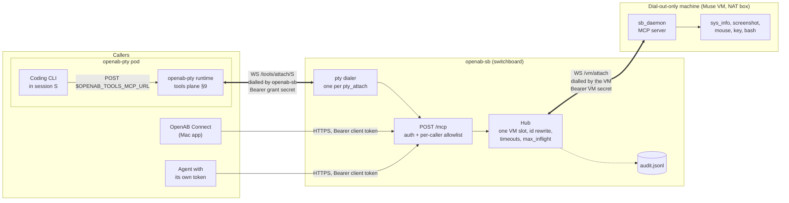

# openab-sb — OpenAB Switchboard

Lets OpenAB Connect and agents in OpenAB PTY sessions call tools on a machine that
**can only dial out** — a Meta Muse Secure VM, a box behind NAT, anything with no inbound
port and no `tailscale serve`.

The machine dials the switchboard over one WebSocket and serves MCP on it. The switchboard
relays calls down that socket and sends the results back. It does not run tools and it
does not store anything.



Thick links are WebSockets, and each label says which side dials. Calls always flow from
the callers toward the VM: the VM dials in and then serves MCP on its own socket, and the
switchboard dials the pod and then answers the pod's requests on that socket. TLS comes
from whatever fronts the switchboard (`tailscale serve` or `cloudflared`; see Run).

## How it fits

- **Southbound (VM → switchboard):** the VM dials `GET /vm/attach` with a bearer secret.
  The frames are plain MCP JSON-RPC, with no custom envelope, so any MCP server becomes a
  switchboard backend by dialling out instead of listening. The contract for the daemon is
  in [`docs/SOUTHBOUND-CONTRACT.md`](docs/SOUTHBOUND-CONTRACT.md), and a reference daemon is
  in [`examples/muse-daemon/`](examples/muse-daemon/sb_daemon.py).
- **Northbound for Connect:** add a computer in Connect with URL `https://<switchboard>/mcp`
  and a client token. Connect calls `sys_info` and `screenshot`. While the VM is offline,
  Connect still finds the switchboard (`/healthz` is 200) and shows the tool error "the VM
  is not connected" rather than "unreachable". `GET /readyz` is the VM-online probe for
  monitoring.
- **Northbound for PTY:** this needs no change to openab-pty. The switchboard plays the
  "Mac" in openab-pty's tools plane (`CLIENT-CONTRACT.md` §9). It dials the pod's
  `/tools/attach/{session}` and serves the VM's tools there, so the CLI in that session
  reaches them through its usual `$OPENAB_TOOLS_MCP_URL`. An agent that can reach the
  switchboard directly can also use `POST /mcp` with its own token.

## Behaviour

| | |
|---|---|
| VMs | one at a time. A newer attach replaces the older one (`4002`), and the older socket's cleanup never touches the newer one. A VM that fails the MCP handshake is closed with `4005` |
| ids | rewritten per call, so callers sharing one socket cannot collide |
| methods | `initialize` and `ping` are answered locally, `tools/list` is filtered, `tools/call` is policed. Everything else gets `-32601` and is not forwarded |
| policy | a per-caller tool allowlist, checked before the request reaches the VM. `vm_status` is always available |
| limits | `max_inflight` (default 8, extra calls are rejected); per-tool timeouts (`screenshot` 10 s, default 60 s); 16 MiB frames from the VM |
| failures | `-32001` VM offline (returned as a tool error so clients keep the server), `-32002` overloaded, `-32003` timed out, `-32004` VM disconnected mid-call. Nothing is retried |
| state | memory only. A restart fails every in-flight call |
| audit | JSON lines, file mode `0600`: attach, detach, takeover, auth failures (capped at 20 a minute, the rest summarised), and every `tools/call` with caller, tool, outcome, latency, size, and (optionally) arguments. Results are never logged |
| reload | `SIGHUP` re-reads credentials. A VM attached with a rotated-out secret is closed with `4003`, including one whose upgrade was authenticated just before the reload |
| PTY attach | redials with backoff on drops, on `4006` (pod replaced) and on proxy errors such as `502`; a `401`/`403`/`429` refusal waits a minute for a fresh grant; stops on every other `4xxx`, per openab-pty §9.2. At most 64 requests from one pod are handled at once |

## Run

Releases ship a static Linux binary (amd64, arm64) and a macOS arm64 binary:

```bash
V=0.1.0; A=linux-amd64   # or linux-arm64, darwin-arm64
curl -fsSLO https://github.com/openabdev/openab-sb/releases/download/v$V/openab-sb-$V-$A.tar.gz
curl -fsSLO https://github.com/openabdev/openab-sb/releases/download/v$V/SHA256SUMS
grep "$A" SHA256SUMS | shasum -a 256 -c -
tar xzf openab-sb-$V-$A.tar.gz
```

Or build from source:

```bash
cargo build --release
./target/release/openab-sb gen-secret            # once for the VM, once per client
cp openab-sb.toml.example openab-sb.toml        # paste the verifiers
./target/release/openab-sb check -c openab-sb.toml
./target/release/openab-sb serve -c openab-sb.toml
```

The switchboard binds loopback and refuses anything else unless you set
`allow_insecure_bind = true`. Put TLS in front of it:

- **The VM can reach your tailnet:** `tailscale serve --bg https / http://127.0.0.1:8790`.
  Connect and the VM both use `https://<host>.<tailnet>.ts.net`.
- **The VM can only reach the public internet:** expose it through a tunnel such as
  `cloudflared`. The bearer tokens are then the only gate, so keep them long (the generated
  ones are 256-bit) and rotate them with `SIGHUP`.

Routes: `POST /mcp`, `GET /vm/attach`, `GET /healthz` (no auth, liveness), `GET /readyz`
(no auth, 200 only when the VM is attached and initialised), `GET /status` (client token).

## Trust

The switchboard holds credentials for both sides and can make the VM do anything its
tools allow. Run it only on a machine you trust. It stores only `sha256:` verifiers, so its
config file cannot be used to dial in or to call out.

The allowlist is policy, not isolation. `key` and `mouse` can open a terminal, so a caller
allowed those tools is effectively allowed a shell. The real boundary is that the VM itself
can be thrown away.

Tool output flows to callers unchanged. Screenshots and shell output from a VM that browses
the web can carry prompt injection, so callers should treat that output as untrusted.

## Not in v1

More than one VM, load balancing, persistent queues or replay, storing results, and
end-to-end encryption (TLS ends at whatever fronts the switchboard).

## Develop

```bash
cargo test     # unit tests + e2e (fake VM, fake openab-pty pod, real sockets)
cargo clippy --all-targets
```

The design came from a discussion with Muse:
<https://muse-relay-arch.violet-coyote.workers.dev/>.
